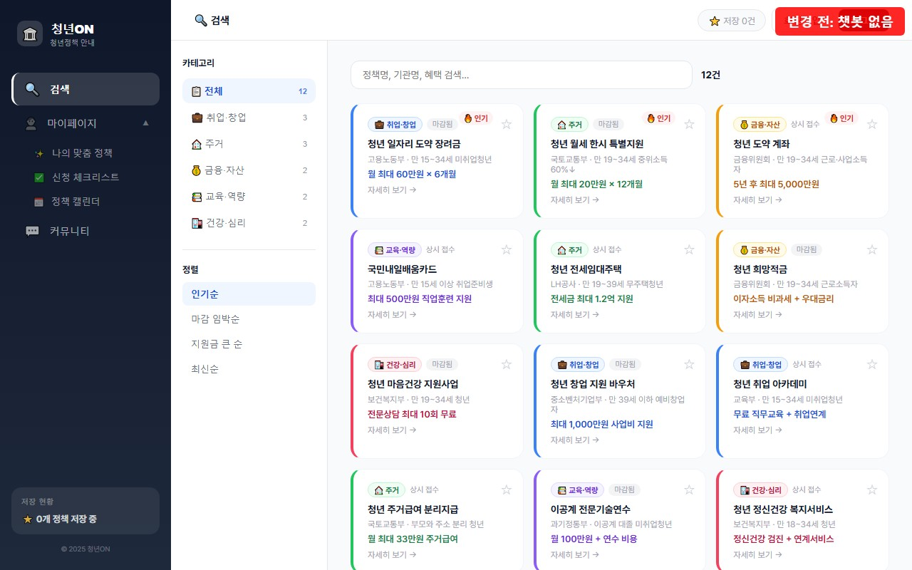
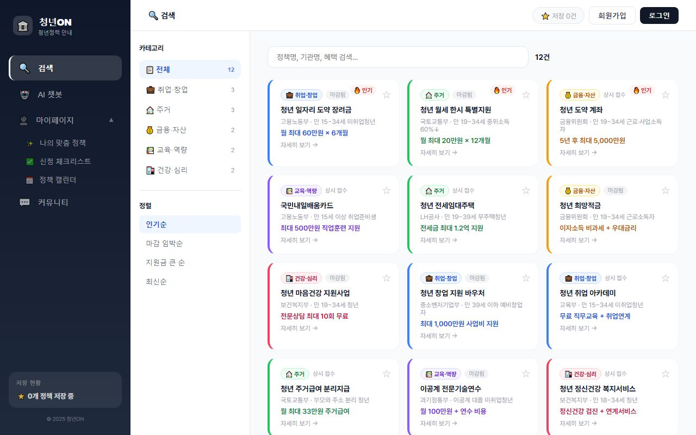

# 청년지원정책 안내 웹사이트

우리 팀이 만든 청년지원정책 안내 웹사이트입니다.

---

## 이 브랜치(feature/chatbot-admin)에서 추가한 것

> **임종권이 작업한 내용입니다. 팀원분들 확인 후 메인에 합칠 예정이에요!**

### 왜 이 작업을 했나요?

**2026.06.10 팀 회의**에서 "정책 비교 기능을 따로 만드는 것보다 **챗봇이 비교해주는 게 낫다**"는 결론이 나왔고,
그래서 제가 AI 챗봇을 만들어서 이 브랜치에 넣었습니다.

**목표:** 일요일(6/14)까지 완성 → 월요일(6/15) 13:20 교수님 미팅

---

### 변경 전 vs 변경 후

#### 변경 전 (main 브랜치 — 지금 GitHub Pages)



- 나이, 지역, 분야를 직접 선택해야 함
- 정해진 조건으로만 검색 가능
- "월세 지원 뭐 있어?" 같은 질문 불가능

#### 변경 후 (이 브랜치 — Vercel 미리보기)



- 자유롭게 말로 질문 가능
- AI가 상황을 이해하고 맞춤 정책 추천
- 추천된 정책이 카드로 예쁘게 표시됨
- 기존 버튼 검색도 그대로 남아있음

---

### 추가된 기능 요약

| 기능 | 설명 |
|------|------|
| **AI 챗봇** | "27살 서울인데 월세 지원 있어?" 같이 말로 물어보면 AI가 맞춤 정책을 찾아줘요 |
| **실시간 답변** | ChatGPT처럼 글자가 하나씩 나와요 (답변 기다리는 동안 안 답답함) |
| **AI가 직접 정책 선별** | AI가 "이 사람한테 이 정책이 맞겠다" 판단해서 골라줘요 |
| **모델 자동 선택** | 무료 AI 모델을 자동으로 골라줌 (비용 0원) |
| **AI 안 될 때 자동 전환** | AI 서버에 문제가 생기면 → 나이/지역/분야 버튼 방식으로 자동 바뀜 (항상 작동) |
| **관리자 페이지** | 오늘 몇 번 사용됐는지, 비용은 얼마인지 확인 가능 |
| **정책 카드** | 추천된 정책을 보기 좋은 카드 형태로 표시 |

---

### 어떻게 작동하나요?

```
사용자가 질문 입력 (예: "서울 25살 월세 지원 있어?")
    ↓
우리 서버(Vercel)가 AI한테 질문을 전달
    ↓
AI가 2,600개 정책 중에서 맞는 거 골라줌
    ↓
답변 + 정책 카드를 화면에 표시
    ↓
사용 기록이 구글시트에 자동 저장 (관리자 페이지에서 확인 가능)
```

- 모든 API 키는 서버에만 있어서 **보안 걱정 없음**
- 무료 모델 사용이라 **비용 0원**
- 하루 150회, 분당 20회 제한 있음 (남용 방지)

---

### 사용한 기술 쉽게 설명

#### Vercel이 뭔가요?

**Vercel** = 우리 웹사이트를 인터넷에 올려주는 서비스 (무료)

- 원래 GitHub Pages로 배포하고 있었는데, AI 챗봇은 서버가 필요해서 Vercel을 추가로 사용합니다
- GitHub에 코드 올리면 자동으로 인터넷에 반영됨

#### OpenRouter가 뭔가요?

**OpenRouter** = 여러 AI 모델을 한 곳에서 쓸 수 있는 서비스

- 원래 강사님이 주신 **OpenAI API 키**를 쓰려고 했는데, 그게 **유료**이고 **충전량을 다 써버렸습니다**
- 그래서 **무료 대안**을 찾았는데, 그게 OpenRouter의 `free` 옵션입니다
- 무료 AI 모델을 자동으로 골라서 사용해주기 때문에 **비용이 0원**입니다
- 단점: 무료라서 가끔 느릴 수 있음 (보통 5~15초, 최대 60초)

#### 온통청년 API가 뭔가요?

**온통청년** = 정부가 운영하는 청년정책 통합 사이트 (youthcenter.go.kr)

- 전국 청년지원정책 **2,600건 이상**의 데이터를 제공하는 공공 API입니다
- 우리 사이트는 이 API에서 정책 데이터를 받아와서 사용합니다
- 일자리, 주거, 교육, 금융/복지, 참여 등 분야별 정책을 모두 포함

#### Google Sheets를 DB로 쓴다고요?

보통 데이터를 저장하려면 별도 **데이터베이스(DB)** 서비스가 필요한데, 유료이거나 설정이 복잡합니다.
우리 프로젝트 규모에서는 **구글 스프레드시트**로 충분해서, DB 대신 사용하고 있습니다.

- 구글시트의 **Apps Script(앱스크립트)** 기능을 이용해서 서버와 자동 연동
- 챗봇이 사용될 때마다 → 시각, 질문 내용, AI 모델, 비용 등이 시트에 자동 기록됨
- 관리자 페이지에서 보이는 사용량/비용 통계가 이 시트에서 나옵니다
- 관리자 페이지 설정값(모델 선택 등)도 여기에 저장됨

> [구글시트 바로가기](https://docs.google.com/spreadsheets/d/1vKSirUpGTuvFy40Hf5y9l_vOp5aNtRFuuC8jTfFpKfs/edit)

---

## 팀원분들 확인 부탁드려요!

아래 링크에서 직접 써보시고 괜찮은지 확인해주세요:

| 뭘 확인하면 되나요? | 링크 |
|---------------------|------|
| 챗봇 써보기 | https://youthsupportpolicy-preview.vercel.app |
| 관리자 페이지 보기 | https://youthsupportpolicy-preview.vercel.app/#admin |
| 기존 버전 비교 | https://yoon-kyoung.github.io/youthsupportpolicy/ |

**체크리스트:**

- [ ] 챗봇한테 질문했을 때 답변이 잘 나오나요?
- [ ] 추천된 정책이 질문 내용과 관련 있나요?
- [ ] 화면이 깨지거나 이상한 부분 없나요?
- [ ] 기존 정책 검색 기능은 그대로 잘 되나요?

확인 다 했으면 **"괜찮다, 합치자"** 한마디 해주시면 됩니다 (GitHub 댓글 or 카톡).

---

## 합치는 과정 (어떻게 반영되나요?)

- **main** = 우리 최종 사이트 (지금은 챗봇 없음)
- **작업 브랜치** = main을 안 건드리고 따로 작업하는 복사본
- **PR(Pull Request)** = "이거 합쳐도 될까요?" 팀한테 물어보는 것

```
main (최종 사이트)
━━━━━━●━━━━━━━━━━━━━━━━━━━━━━━━━━━━━━━━━━━━━━━━━●━━━  챗봇 추가 완료!
      ┃                                          ▲
      ┃  원본은 안 건드리고                       ┃
      ┃  복사본에서 따로 작업합니다               ┃  ④ Merge (합치기)
      ▼                                          ┃
━━━━━━●━━━━━●━━━━━●━━━━━●━━━━━●━━━━ PR 요청 ━━━━┛
      ┊     ┊     ┊     ┊     ┊
     챗봇   API   관리자  테스트  완성!
     개발   연결   페이지  검증

작업 브랜치 (feature/chatbot-admin)
```

**순서:**
1. 임종권이 작업 브랜치에서 챗봇 개발 (main은 안전하게 보존)
2. 다 되면 **PR(Pull Request) 올림** — "이거 합쳐도 될까요?"
3. 팀원분들이 확인하고 "괜찮다!" (GitHub 댓글 or 카톡)
4. **최윤경님이 GitHub에서 "Merge" 버튼 클릭** → main에 합쳐짐 → 사이트 반영!

---

## 팀 역할 (6/10 회의 기준)

| 이름 | 담당 |
|------|------|
| 박수아 | 정책 비교 기능 방향 정리 |
| 권규빈 | 디자인 방향, 컬러 조합 |
| 최윤경 | 커뮤니티 기능, 전체 개발 총괄 |
| 임종권 | 챗봇 + API 연결 + 관리자 페이지 |

## 사용 기술

| 기술 | 설명 |
|------|------|
| React + Vite | 웹사이트 만드는 도구 |
| Vercel | 웹사이트 + AI 서버 배포 (무료) |
| OpenRouter API | 무료 AI 모델 서비스 |
| 온통청년 API | 정부 청년정책 데이터 (2,600건+) |
| [Google Sheets](https://docs.google.com/spreadsheets/d/1vKSirUpGTuvFy40Hf5y9l_vOp5aNtRFuuC8jTfFpKfs/edit) | 사용량 기록 + 설정 저장 (무료 DB 대용) |
